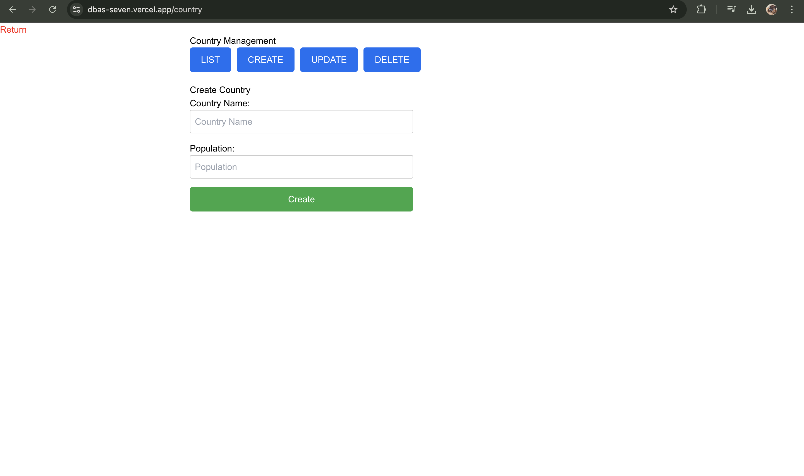

# CSCI 341 - Assignment 3 (Bonus Part)

**Website:** [https://dbas-seven.vercel.app](https://dbas-seven.vercel.app)

---

This is a project done for Assignment 3 of CSCI 341 - Database Systems course.

## 🚀 Live Website

Visit the live application here:  
👉 [https://dbas-seven.vercel.app](https://dbas-seven.vercel.app)

---

## 🛠️ Tech Stack

| **Technology**   | **Purpose**           |
| ---------------- | --------------------- |
| **Next.js**      | Frontend Framework    |
| **Tailwind CSS** | Styling Framework     |
| **Express.js**   | Backend Framework     |
| **Vercel**       | Frontend Deployment   |
| **Azure**        | Backend&DB Deployment |

---

### Locla Setup Instructions

1. Clone the repository:
   ```bash
   git clone https://github.com/yourusername/dbas.git
   cd dbas
   ```

### Frontend setup

1. Navigate to the frontend directory and install dependencies:

   ```bash
   cd frontend
   npm install
   ```

2. Create .env file and add BACKEND_URL:

   ```bash
   touch .env
   ```

3. Start the development:

   ```bash
   npm run dev
   ```

### Backend setup

1. Navigate to the backend directory and run:
   ```bash
   npm install
   npm start
   ```
2. Add database variables to .env:

   ```bash
   mv .env.example .env
   ```

3. Start the development:

   ```bash
   npm run start
   ```

---

## Screenshots

Here are screenshots of the website:





## Demo Video

[Watch the demo video](assets/demo.mp4)
